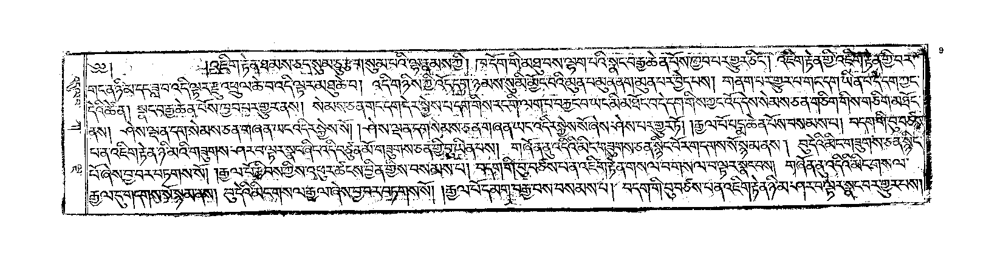
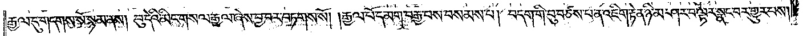

## Source Page Image


We have a line detection model OCR model https://github.com/eric86y/TibetanOCR/blob/main/Demo-Prediction.ipynb

so we use those two models and use its prediction to create a synthetic line/transcription pair for all the line in the page image
and then we stream that line text prediction and the line detected line image to the prodigy. The annotators have proofread those
prediciton and then reviewed by the reviewer.

## Segmented line image and transcribe


```
text: "\u0f62\u0f92\u0fb1\u0f63\u0f0b\u0f51\u0f74\u0f0b\u0f42\u0f51\u0f42\u0f66\u0f0b\u0f66\u0f7c\u0f0b\u0f66\u0f99\u0f58\u0f0b\u0f53\u0f66\u0f0d \u0f56\u0f74\u0f0b\u0f51\u0f7a\u0f60\u0f72\u0f0b\u0f58\u0f72\u0f44\u0f0b\u0f42\u0f66\u0f63\u0f0b\u0f62\u0f92\u0fb1\u0f63\u0f0b\u0f5e\u0f7a\u0f66\u0f0b\u0f56\u0fb1\u0f0b\u0f56\u0f62\u0f0b\u0f56\u0f4f\u0f42\u0f66\u0f0b\u0f66\u0f7c\u0f0d \u0f0d\u0f62\u0f92\u0fb1\u0f63\u0f0b\u0f54\u0f7c\u0f0b\u0f51\u0f58\u0f42\u0f0b\u0f56\u0f62\u0f92\u0fb1\u0f56\u0f66\u0f0b\u0f56\u0f66\u0f58\u0f66\u0f0b\u0f54\u0f0d \u0f56\u0f51\u0f42\u0f0b\u0f42\u0f72\u0f0b\u0f56\u0f74\u0f0b\u0f56\u0f59\u0f66\u0f0b\u0f54\u0f0b\u0f53\u0f0b\u0f60\u0f47\u0f72\u0f42\u0f0b\u0f62\u0f9f\u0f7a\u0f53\u0f0b\u0f49\u0f72\u0f0b\u0f58\u0f0b\u0f64\u0f62\u0f0b\u0f56\u0f0b\u0f63\u0f9f\u0f62\u0f0b\u0f66\u0fa3\u0f44\u0f0b\u0f56\u0f62\u0f0b\u0f42\u0fb1\u0f74\u0f62\u0f0b\u0f54\u0f66\u0f0d"
```

```
རྒྱལ་དུ་གདགས་སོ་སྙམ་ནས། བུ་དེའི་མིང་གསལ་རྒྱལ་ཞེས་བྱ་བར་བཏགས་སོ། །རྒྱལ་པོ་དམག་བརྒྱབས་བསམས་པ། བདག་གི་བུ་བཙས་པ་ན་འཇིག་རྟེན་ཉི་མ་ཤར་བ་ལྟར་སྣང་བར་གྱུར་པས།
```

## To do
after the proofreading and reviewing of those proofread, we get a jsonl from the prodigy, we need to convert it to PAGE XML standard format for training data